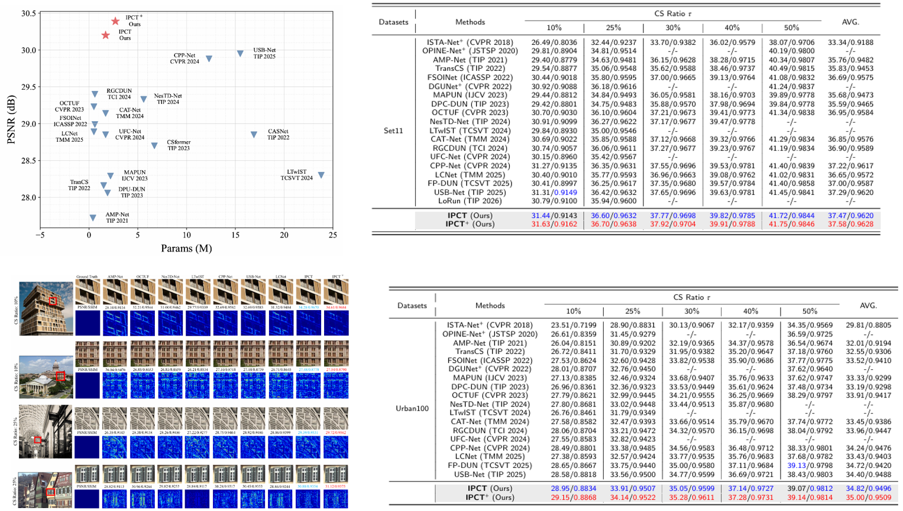

# IPCT

PyTorch implementation of **IPCT (Iterative Physics-Conditioned Transformer)** for image compressive sensing. 

## Requirements

Python 3.8+ and PyTorch 1.11+ are recommended. Install the remaining dependencies with:

```bash
pip install numpy opencv-python scikit-image matplotlib einops tqdm
```

## Pre-trained weights

Pre-trained models are available from [Google Drive](https://drive.google.com/drive/folders/124lm_5fmAGlwcUjVt4PABGKNYFnHpg08?usp=drive_link).

```text
pth/
├── base/   # 16 phases
└── base+/  # 25 phases
```

## Test a pre-trained model

The example images are in `data/Set11`. To evaluate the IPCT model at a 10% CS ratio and save reconstructed images:

```bash
python test.py --model base --cs_ratio 0.10 --epochs 100 --test_name Set11 --save_flag True
python test.py --model base+ --cs_ratio 0.10 --epochs 100 --test_name Set11 --save_flag True
```

Results are written to `result/<model>/<dataset>/<cs_ratio>/`. 

## Data layout

```text
data/
├── Set11/       # test images (included)
│   ├── cameraman.tif
│   └── ...
└── WED/         # training images (user-provided)
```
## Results



## Acknowledgements

This code is built on [OCTUF](https://github.com/songjiechong/OCTUF) and [PRL](https://github.com/Guaishou74851/PRL). We thank the authors for sharing their code.

